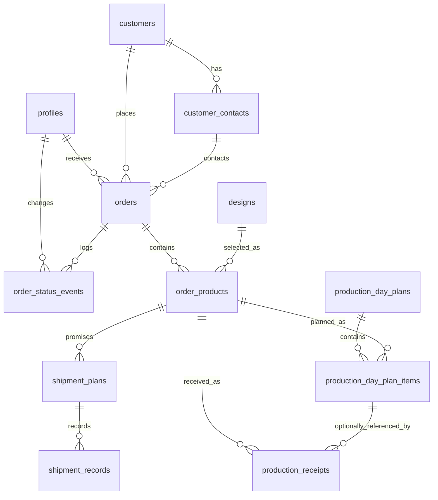

# DSS Current Database Schema

## 문서 상태

- 작성일: 2026-06-13
- 대상 DB: Supabase PostgreSQL
- 목적: 현재 프론트엔드에서 확정된 주문, 생산계획, 생산결과, 재고, 출하 데이터 구조를 기준으로 새 DB schema를 정리한다.

## Source of Truth 우선순위

이 문서는 아래 우선순위로 통합했다.

1. 현재 프론트엔드 코드에서 실제 사용하는 데이터 구조
   - `src/features/orders/types.ts`
   - `src/features/orders/actions.ts`
   - `src/features/orders/local-state.ts`
   - `src/features/production/types.ts`
   - `src/features/production/daily-planning.ts`
   - `src/features/production/product-status.ts`
   - `src/features/production/product-management.ts`
   - `src/components/inventory/InventoryManagementWorkspace.tsx`
2. `docs/data_structure/order-production-shipment-model.md`
3. `docs/database_schema.md`

두 문서가 충돌하면 `docs/data_structure/order-production-shipment-model.md`를 우선한다. 단, 프론트엔드에서 이미 바뀐 구조가 있으면 프론트엔드 구조를 최우선으로 삼는다.

## 핵심 변경 요약

- 주문은 `orders` 헤더와 `order_products` 라인으로 분리한다.
- 하나의 주문은 하나 이상의 `order_products`를 가진다.
- 같은 설계라도 주문 규격이나 주문 맥락이 다르면 다른 `order_products`로 취급한다.
- 생산계획은 `order_products.id` 기준으로 작성한다.
- 생산계획은 완료수량을 저장하지 않는다.
- 생산 결과 입력은 `production_receipts`에 append-only 원장으로 남긴다.
- 현재 재고는 `order_products.id` 기준으로 계산한다.
- 출하는 생산계획 항목이 아니라 `order_products.id` 기준 재고에서 FIFO로 차감한다.
- `delivery_schedules`, `production_tasks`, 주문 단일 제품 모델은 레거시 초안으로 보고 새 스키마의 핵심 테이블에서 제외한다.

## 최상위 관계

```text
profiles

customers
  -> customer_contacts
  -> orders

designs
  -> order_products

orders
  -> order_products
    -> shipment_plans
      -> shipment_records
    -> production_day_plan_items
    -> production_receipts

production_day_plans
  -> production_day_plan_items
```

## 재고 기준

재고 기준은 `order_products.id`다.

```text
received_quantity(order_product_id)
  = sum(production_receipts.quantity)

shipped_quantity(order_product_id)
  = sum(shipment_records.quantity joined through shipment_plans.order_product_id)

stock_quantity(order_product_id)
  = received_quantity - shipped_quantity

remaining_receivable_quantity(order_product_id)
  = order_products.quantity - received_quantity
```

현재 프론트엔드의 `[재고 관리] -> [재고 현황]`은 `production_receipts` 기준 입고 수량으로 재고를 계산한다. 출하 입력 화면이 붙으면 `shipment_records`가 출고 원장이 되고, 재고 현황은 위 공식처럼 입고에서 출고를 차감한다.

`[재고 관리] -> [입/출고 내역]`은 별도 source table을 새로 만들기보다 `production_receipts`와 `shipment_records`를 합친 view로 시작한다.

## Enum

### `app_role`

| 값 | 의미 |
| --- | --- |
| `A` | 사무직 |
| `P` | 현장직 |
| `E` | 임원 |

### `order_status`

주문 자체의 운영 상태다. 생산 진행률이나 출하 완료율의 source of truth가 아니다.

| 값 | 의미 |
| --- | --- |
| `active` | 접수 상태. 사무직이 수정, 취소, 생산팀 전달 가능 |
| `released` | 생산팀 전달 완료 |
| `completed` | 주문 lifecycle 완료 |
| `cancelled` | 주문 취소 |

### `department_code`

| 값 | 의미 |
| --- | --- |
| `R` | R 부서 |
| `S` | S 부서 |
| `P` | P 부서 |

### `shipment_status`

| 값 | 의미 |
| --- | --- |
| `ready` | 출하 대기 |
| `partial` | 부분 출하 |
| `completed` | 출하 완료 |
| `stopped` | 출하 중지 |

### `production_duration_source`

| 값 | 의미 |
| --- | --- |
| `product_default` | 주문제품 snapshot의 기본 시간당 생산량으로 계산 |
| `manual_override` | 사용자가 수동 조정 |

### `production_plan_status`

| 값 | 의미 |
| --- | --- |
| `scheduled` | 일정판에 편성됨 |
| `cancelled` | 계획 취소 |

### `production_receipt_quality_status`

| 값 | 의미 |
| --- | --- |
| `not_recorded` | 미입력 |
| `passed` | 합격 |
| `failed` | 불합격 |

### `production_receipt_transaction_type`

| 값 | 의미 |
| --- | --- |
| `production_receipt` | 생산 입고 |
| `correction` | 정정 거래 |

## 테이블

### `profiles`

Supabase Auth 사용자와 DSS 사용자 정보를 연결한다.

| 컬럼 | 타입 | 제약 | 설명 |
| --- | --- | --- | --- |
| `id` | `uuid` | PK, FK `auth.users.id` | 사용자 ID |
| `email` | `text` | not null, unique | 로그인 이메일 |
| `display_name` | `text` | not null | 화면 표시 이름 |
| `role` | `app_role` | not null | 권한 |
| `department_code` | `text` | nullable | 기본 부서 힌트. 생산직은 `R/S/P`, 사무직/임원은 `office`, `executive` 등 가능 |
| `is_active` | `boolean` | not null default `true` | 사용 여부 |
| `created_at` | `timestamptz` | not null default `now()` | 생성 시각 |
| `updated_at` | `timestamptz` | not null default `now()` | 수정 시각 |

### `customers`

고객사 기준정보다.

| 컬럼 | 타입 | 제약 | 설명 |
| --- | --- | --- | --- |
| `id` | `uuid` | PK default `gen_random_uuid()` | 고객사 ID |
| `name` | `text` | not null | 고객사명 |
| `ticker` | `text` | not null, unique | 주문번호 생성용 고객 코드 |
| `last_order_sequence` | `integer` | not null default `0` | 고객별 마지막 주문 순번 |
| `business_registration_no` | `text` | nullable, unique | 사업자번호 |
| `identifier` | `text` | nullable | 기타 식별자 |
| `is_active` | `boolean` | not null default `true` | 사용 여부 |
| `created_at` | `timestamptz` | not null default `now()` | 생성 시각 |
| `updated_at` | `timestamptz` | not null default `now()` | 수정 시각 |
| `deleted_at` | `timestamptz` | nullable | soft delete 시각 |

주요 제약:

- `ticker`는 대문자 영문 또는 숫자만 허용한다.
- 주문번호 생성 시 고객 row를 잠그고 `last_order_sequence` 증가와 주문 생성을 같은 트랜잭션에서 처리한다.

### `customer_contacts`

고객사 담당자 기준정보다.

| 컬럼 | 타입 | 제약 | 설명 |
| --- | --- | --- | --- |
| `id` | `uuid` | PK default `gen_random_uuid()` | 담당자 ID |
| `customer_id` | `uuid` | FK `customers.id`, not null | 고객사 |
| `name` | `text` | not null | 담당자명 |
| `phone` | `text` | nullable | 전화번호 |
| `email` | `text` | nullable | 이메일 |
| `position` | `text` | nullable | 직책 |
| `is_active` | `boolean` | not null default `true` | 사용 여부 |
| `created_at` | `timestamptz` | not null default `now()` | 생성 시각 |
| `updated_at` | `timestamptz` | not null default `now()` | 수정 시각 |
| `deleted_at` | `timestamptz` | nullable | soft delete 시각 |

### `designs`

제품/설계 기준정보다.

| 컬럼 | 타입 | 제약 | 설명 |
| --- | --- | --- | --- |
| `id` | `uuid` | PK default `gen_random_uuid()` | 설계 ID |
| `design_no` | `text` | not null, unique | 설계번호 |
| `product_name` | `text` | not null | 제품명 |
| `specification` | `text` | not null | 기본 규격 |
| `department_code` | `department_code` | not null | 기본 생산 부서 |
| `default_units_per_hour` | `integer` | not null, check `> 0` | 기본 시간당 생산량 |
| `is_active` | `boolean` | not null default `true` | 사용 여부 |
| `created_at` | `timestamptz` | not null default `now()` | 생성 시각 |
| `updated_at` | `timestamptz` | not null default `now()` | 수정 시각 |
| `deleted_at` | `timestamptz` | nullable | soft delete 시각 |

### `orders`

주문 헤더다. 제품, 제품 수량, 출하계획은 직접 저장하지 않는다.

| 컬럼 | 타입 | 제약 | 설명 |
| --- | --- | --- | --- |
| `id` | `uuid` | PK default `gen_random_uuid()` | 주문 ID |
| `order_no` | `text` | not null, unique | 주문번호 |
| `customer_order_sequence` | `integer` | not null | 고객별 주문 순번 |
| `status` | `order_status` | not null default `active` | 주문 운영 상태 |
| `requested_date` | `date` | not null | 주문 요청일 |
| `channel` | `text` | not null | 발주 채널 |
| `customer_id` | `uuid` | FK `customers.id`, not null | 고객사 |
| `contact_id` | `uuid` | FK `customer_contacts.id`, not null | 담당자 |
| `received_by` | `uuid` | FK `profiles.id`, not null | 접수자 |
| `released_at` | `timestamptz` | nullable | 생산팀 전달 시각 |
| `released_by` | `uuid` | FK `profiles.id`, nullable | 생산팀 전달자 |
| `completed_at` | `timestamptz` | nullable | 주문 완료 시각 |
| `completed_by` | `uuid` | FK `profiles.id`, nullable | 주문 완료 처리자 |
| `cancelled_at` | `timestamptz` | nullable | 취소 시각 |
| `cancelled_by` | `uuid` | FK `profiles.id`, nullable | 취소 처리자 |
| `created_at` | `timestamptz` | not null default `now()` | 생성 시각 |
| `updated_at` | `timestamptz` | not null default `now()` | 수정 시각 |

주문번호 형식:

```text
O-{CUSTOMER_TICKER}-{YYMMDD}{CUSTOMER_ORDER_SEQUENCE_5_DIGITS}
```

예시:

```text
O-DSE-26061100005
```

주요 제약:

- `contact_id`는 같은 `customer_id`에 속해야 한다.
- `status = released`이면 `released_at`, `released_by`가 있어야 한다.
- `status = completed`이면 `completed_at`, `completed_by`가 있어야 한다.
- `status = cancelled`이면 `cancelled_at`, `cancelled_by`가 있어야 한다.
- `active` 상태 주문만 수정, 취소, 생산팀 전달할 수 있다.

### `order_products`

주문 안의 제품 라인이다. 생산계획, 생산결과, 재고, 출하 계산의 중심 테이블이다.

| 컬럼 | 타입 | 제약 | 설명 |
| --- | --- | --- | --- |
| `id` | `uuid` | PK default `gen_random_uuid()` | 주문제품 ID |
| `order_id` | `uuid` | FK `orders.id` on delete cascade, not null | 주문 |
| `design_id` | `uuid` | FK `designs.id`, not null | 선택한 설계 |
| `quantity` | `integer` | not null, check `> 0` | 주문제품 수량 |
| `design_no_snapshot` | `text` | not null | 주문 시점 설계번호 |
| `product_name_snapshot` | `text` | not null | 주문 시점 제품명 |
| `specification_snapshot` | `text` | not null | 주문 시점 규격 |
| `department_code_snapshot` | `department_code` | not null | 주문 시점 생산 부서 |
| `default_units_per_hour_snapshot` | `integer` | not null, check `> 0` | 주문 시점 기본 시간당 생산량 |
| `created_at` | `timestamptz` | not null default `now()` | 생성 시각 |
| `updated_at` | `timestamptz` | not null default `now()` | 수정 시각 |

주요 제약:

- 주문 후 `designs`가 바뀌어도 생산계획과 생산결과는 snapshot 값을 기준으로 표시한다.
- 같은 주문 안에 여러 주문제품을 둘 수 있다.
- 같은 설계라도 주문 규격이나 주문 맥락이 다르면 별도 `order_products`로 저장한다.

### `shipment_plans`

고객에게 약속한 출하 예정일과 수량이다. 생산계획을 직접 참조하지 않는다.

| 컬럼 | 타입 | 제약 | 설명 |
| --- | --- | --- | --- |
| `id` | `uuid` | PK default `gen_random_uuid()` | 출하계획 ID |
| `order_id` | `uuid` | FK `orders.id` on delete cascade, not null | 주문 |
| `order_product_id` | `uuid` | FK `order_products.id` on delete cascade, not null | 주문제품 |
| `planned_ship_date` | `date` | not null | 출하 예정일 |
| `quantity` | `integer` | not null, check `> 0` | 출하 예정 수량 |
| `status` | `shipment_status` | not null default `ready` | 출하 상태 |
| `shipped_quantity` | `integer` | not null default `0`, check `>= 0` | 누적 출하 수량 캐시 |
| `last_shipped_date` | `date` | nullable | 마지막 출하일 |
| `note` | `text` | nullable | 비고 |
| `created_at` | `timestamptz` | not null default `now()` | 생성 시각 |
| `updated_at` | `timestamptz` | not null default `now()` | 수정 시각 |

주요 제약:

- 같은 `order_product_id`의 `shipment_plans.quantity` 합계는 `order_products.quantity`와 같아야 한다.
- `order_id`와 `order_product_id`는 같은 주문 계층에 속해야 한다.
- `shipped_quantity <= quantity`

상태 규칙:

```text
shipped_quantity = 0
  -> ready 또는 stopped

0 < shipped_quantity < quantity
  -> partial 또는 stopped

shipped_quantity = quantity
  -> completed
```

### `shipment_records`

실제 출하 이력이다. 후속 출하 화면에서 입력한다.

| 컬럼 | 타입 | 제약 | 설명 |
| --- | --- | --- | --- |
| `id` | `uuid` | PK default `gen_random_uuid()` | 출하 이력 ID |
| `shipment_plan_id` | `uuid` | FK `shipment_plans.id` on delete cascade, not null | 출하계획 |
| `shipped_date` | `date` | not null | 실제 출하일 |
| `quantity` | `integer` | not null, check `> 0` | 출하 수량 |
| `created_by` | `uuid` | FK `profiles.id`, not null | 입력자 |
| `created_at` | `timestamptz` | not null default `now()` | 생성 시각 |

주요 제약:

- 같은 `shipment_plan_id`의 출하 이력 합계는 `shipment_plans.quantity`를 초과할 수 없다.
- 같은 `order_product_id`의 전체 출하 수량은 현재 재고 수량을 초과할 수 없다.
- 출하 차감은 `order_product_id` 기준 재고에서 FIFO로 처리한다.
- 출하 입력 후 같은 트랜잭션에서 `shipment_plans.shipped_quantity`, `shipment_plans.status`, `shipment_plans.last_shipped_date`를 갱신한다.

### `production_day_plans`

특정 날짜와 부서의 생산 일정판이다.

| 컬럼 | 타입 | 제약 | 설명 |
| --- | --- | --- | --- |
| `id` | `uuid` | PK default `gen_random_uuid()` | 생산일 계획 ID |
| `production_date` | `date` | not null | 생산일 |
| `department_code` | `department_code` | not null | 생산 부서 |
| `work_start_time` | `time` | not null default `'09:00'` | 작업 시작 시각 |
| `created_at` | `timestamptz` | not null default `now()` | 생성 시각 |
| `updated_at` | `timestamptz` | not null default `now()` | 수정 시각 |

주요 제약:

- `(production_date, department_code)`는 유일해야 한다.
- 프론트엔드는 30분 단위 시작 시간을 선택한다.

### `production_day_plan_items`

특정 날짜에 특정 주문제품을 얼마만큼 생산할지 나타내는 계획 항목이다.

| 컬럼 | 타입 | 제약 | 설명 |
| --- | --- | --- | --- |
| `id` | `uuid` | PK default `gen_random_uuid()` | 생산계획 항목 ID |
| `production_day_plan_id` | `uuid` | FK `production_day_plans.id` on delete cascade, not null | 생산일 계획 |
| `order_product_id` | `uuid` | FK `order_products.id`, not null | 주문제품 |
| `quantity` | `integer` | not null, check `> 0` | 계획 생산 수량 |
| `estimated_duration_minutes` | `integer` | not null, check `> 0` | 예상 소요 시간 |
| `duration_source` | `production_duration_source` | not null | 소요 시간 산정 방식 |
| `planning_status` | `production_plan_status` | not null default `scheduled` | 계획 상태 |
| `sequence` | `integer` | not null, check `> 0` | 일정판 안의 순서 |
| `start_time` | `time` | not null | 시작 시각 |
| `end_time` | `time` | not null | 종료 시각 |
| `note` | `text` | nullable | 비고 |
| `created_at` | `timestamptz` | not null default `now()` | 생성 시각 |
| `updated_at` | `timestamptz` | not null default `now()` | 수정 시각 |

주요 제약:

- 같은 `production_day_plan_id` 안에서 `sequence`는 유일해야 한다.
- `end_time > start_time`
- `order_products.department_code_snapshot`은 `production_day_plans.department_code`와 같아야 한다.
- 같은 `order_product_id`의 취소되지 않은 계획 수량 합계는 `order_products.quantity`를 초과할 수 없다.
- `shipment_plan_id`, `completed_quantity`, `producing/completed` 상태 컬럼은 두지 않는다.

소요 시간 기본 계산:

```ts
estimatedDurationMinutes =
  Math.ceil((quantity / defaultUnitsPerHourSnapshot) * 60);
```

### `production_receipts`

`[생산 결과]`에서 입력하는 생산 입고 원장이다. 현재 재고 수량의 입고 source다.

| 컬럼 | 타입 | 제약 | 설명 |
| --- | --- | --- | --- |
| `id` | `uuid` | PK default `gen_random_uuid()` | 생산 입고 ID |
| `order_product_id` | `uuid` | FK `order_products.id`, not null | 주문제품 |
| `receipt_date` | `date` | not null | 생산 입고일 |
| `quantity` | `integer` | not null | 입고 또는 정정 수량 |
| `lot_no` | `text` | not null | LOT/배치번호. 미입력 시 시스템 생성 |
| `equipment_line` | `text` | nullable | 설비 또는 라인 |
| `storage_location` | `text` | nullable | 보관 위치 |
| `quality_status` | `production_receipt_quality_status` | not null default `not_recorded` | 품질 상태 |
| `operator_name` | `text` | nullable | 담당자 |
| `memo` | `text` | nullable | 비고 |
| `production_day_plan_item_id` | `uuid` | FK `production_day_plan_items.id`, nullable | 관련 생산계획 항목. 선택값 |
| `transaction_type` | `production_receipt_transaction_type` | not null default `production_receipt` | 거래 유형 |
| `created_by` | `uuid` | FK `profiles.id`, nullable | 입력자 |
| `created_at` | `timestamptz` | not null default `now()` | 생성 시각 |

주요 제약:

- `transaction_type = production_receipt`이면 `quantity > 0`
- `transaction_type = correction`이면 `quantity <> 0`
- 정정은 원본 row를 직접 수정하지 않고 새 row로 추가한다.
- 같은 `order_product_id`의 누적 생산 입고 수량은 `order_products.quantity`를 초과할 수 없다.
- 같은 `order_product_id`의 누적 생산 입고 수량은 음수가 될 수 없다.
- `production_day_plan_item_id`는 선택값이며, 비어 있어도 입고 원장은 유효하다.
- `production_day_plan_item_id`를 채워도 특정 계획 행의 완료율을 계산하지 않는다.

LOT 자동 생성 기본 형식:

```text
LOT-{YYYYMMDD}-{SEQUENCE_3_DIGITS}
```

예시:

```text
LOT-20260613-001
```

### `order_status_events`

주문 운영 상태 변경 이력이다.

| 컬럼 | 타입 | 제약 | 설명 |
| --- | --- | --- | --- |
| `id` | `uuid` | PK default `gen_random_uuid()` | 이벤트 ID |
| `order_id` | `uuid` | FK `orders.id` on delete cascade, not null | 주문 |
| `from_status` | `order_status` | nullable | 이전 상태 |
| `to_status` | `order_status` | not null | 변경 상태 |
| `changed_by` | `uuid` | FK `profiles.id`, nullable | 변경자 |
| `changed_at` | `timestamptz` | not null default `now()` | 변경 시각 |
| `note` | `text` | nullable | 비고 |

## 조회 View

### `inventory_status_view`

`[재고 관리] -> [재고 현황]`의 기본 조회 모델이다.

권장 컬럼:

| 컬럼 | 설명 |
| --- | --- |
| `order_product_id` | 주문제품 ID |
| `order_id` | 주문 ID |
| `order_no` | 주문번호 |
| `customer_name` | 고객사 |
| `design_no` | 설계번호 snapshot |
| `product_name` | 제품명 snapshot |
| `specification` | 규격 snapshot |
| `department_code` | 부서 snapshot |
| `order_quantity` | 주문제품 수량 |
| `received_quantity` | 생산 입고 누적 수량 |
| `shipped_quantity` | 출하 누적 수량 |
| `stock_quantity` | 현재 재고 수량 |
| `remaining_receivable_quantity` | 추가 생산 입고 가능 수량 |
| `receipt_count` | 생산 입고 거래 건수 |

계산:

```sql
stock_quantity = received_quantity - shipped_quantity
remaining_receivable_quantity = greatest(0, order_quantity - received_quantity)
```

### `inventory_ledger_view`

`[재고 관리] -> [입/출고 내역]`의 후속 조회 모델이다.

권장 컬럼:

| 컬럼 | 설명 |
| --- | --- |
| `ledger_id` | 원천 row ID |
| `source_table` | `production_receipts` 또는 `shipment_records` |
| `order_product_id` | 주문제품 ID |
| `transaction_date` | 입고일 또는 출하일 |
| `direction` | `in` 또는 `out` |
| `quantity` | 양수 수량 |
| `signed_quantity` | 입고는 양수, 출고는 음수 |
| `lot_no` | LOT/배치번호. 출고 row는 nullable |
| `related_shipment_plan_id` | 출하계획 ID. 입고 row는 nullable |
| `created_by` | 입력자 |
| `created_at` | 생성 시각 |

초기 구현은 view로 충분하다. 명시적인 재고 거래 테이블이 필요해지는 시점은 LOT allocation, 창고 이동, 폐기, 재작업 같은 별도 거래 유형이 실제 요구될 때다.

## 주요 트랜잭션

### 주문 생성

1. 고객과 담당자를 선택한다.
2. 고객 row를 잠그고 `customers.last_order_sequence`를 증가시킨다.
3. `orders.order_no`를 생성한다.
4. `orders`를 `active` 상태로 생성한다.
5. 하나 이상의 `order_products`를 생성한다.
6. 각 `order_products` 아래에 하나 이상의 `shipment_plans`를 생성한다.
7. 각 주문제품의 `shipment_plans.quantity` 합계가 `order_products.quantity`와 같은지 검증한다.
8. `order_status_events`에 `active` 이벤트를 기록한다.

주문 생성 시점에 생산계획 draft를 만들지 않는다.

### 주문 수정

1. `orders.status = active`인 주문만 수정한다.
2. `orders`, `order_products`, `shipment_plans`를 하나의 트랜잭션에서 갱신한다.
3. 주문번호는 변경하지 않는다.
4. 출하계획 수량 합계를 다시 검증한다.

### 생산팀 전달

1. `orders.status = active`인 주문만 전달할 수 있다.
2. `orders.status`를 `released`로 변경한다.
3. `released_at`, `released_by`를 기록한다.
4. `order_status_events`를 기록한다.

생산팀 전달 시점에도 생산계획 row를 자동 생성하지 않는다.

### 생산계획 확정

1. 사용자가 생산일과 부서를 선택한다.
2. `production_day_plans`를 생성하거나 조회한다.
3. 주문제품을 선택하고 계획 수량을 입력한다.
4. `estimated_duration_minutes`를 계산한다.
5. `sequence`, `start_time`, `end_time`을 계산한다.
6. `production_day_plan_items`를 생성 또는 갱신한다.
7. 같은 주문제품의 취소되지 않은 계획 수량 합계가 주문제품 수량을 초과하지 않는지 검증한다.

### 생산 결과 입력

1. `[생산 결과]`에서 주문제품을 선택한다.
2. 생산 수량을 입력한다.
3. LOT를 비우면 시스템이 자동 생성한다.
4. 누적 생산 입고 수량이 주문제품 수량을 초과하지 않는지 검증한다.
5. `production_receipts`에 append-only row를 생성한다.
6. 관련 생산계획 항목은 선택값으로만 저장한다.

### 출하 실적 입력

1. 출하계획을 선택한다.
2. 선택한 출하계획의 `order_product_id` 기준 현재 재고를 계산한다.
3. 출하 수량이 현재 재고와 출하계획 잔량을 초과하지 않는지 검증한다.
4. FIFO 기준으로 재고를 차감한다.
5. `shipment_records`를 생성한다.
6. `shipment_plans.shipped_quantity`, `status`, `last_shipped_date`를 갱신한다.

## RLS / 권한 초안

| 테이블 또는 View | A | P | E |
| --- | --- | --- | --- |
| `profiles` | 자기 정보 조회 | 자기 정보 조회 | 자기 정보 조회 |
| `customers` | 조회 | 조회 | 조회 |
| `customer_contacts` | 조회 | 조회 | 조회 |
| `designs` | 조회 | 조회 | 조회 |
| `orders` | 생성, 수정, 취소, 전달, 조회 | 조회 | 조회 |
| `order_products` | 주문 생성/수정 시 관리, 조회 | 조회 | 조회 |
| `shipment_plans` | 주문 생성/수정 시 관리, 조회 | 조회 | 조회 |
| `production_day_plans` | 조회 | 생성, 수정, 조회 | 조회 |
| `production_day_plan_items` | 조회 | 생성, 수정, 취소, 조회 | 조회 |
| `production_receipts` | 조회 | 생성, 정정, 조회 | 조회 |
| `inventory_status_view` | 조회 | 조회 | 조회 |
| `inventory_ledger_view` | 조회 | 조회 | 조회 |
| `shipment_records` | 조회 | 생성, 조회 | 조회 |
| `order_status_events` | 생성, 조회 | 조회 | 조회 |

초기에는 Server Action에서 역할별 액션을 제한하고, Supabase 클라이언트 직접 접근을 허용하는 테이블에는 RLS를 켠다.

## 인덱스 권장안

- `profiles (email)`
- `customers (ticker)`
- `customers (is_active, name)`
- `customer_contacts (customer_id, is_active)`
- `designs (design_no)`
- `designs (department_code, is_active)`
- `orders (status, created_at desc)`
- `orders (order_no)`
- `orders (customer_id, requested_date desc)`
- `order_products (order_id)`
- `order_products (design_id)`
- `order_products (department_code_snapshot)`
- `shipment_plans (order_product_id, planned_ship_date)`
- `shipment_plans (status, planned_ship_date)`
- `shipment_records (shipment_plan_id, shipped_date desc)`
- `production_day_plans (production_date, department_code)` unique
- `production_day_plan_items (production_day_plan_id, sequence)` unique
- `production_day_plan_items (order_product_id)`
- `production_receipts (order_product_id, receipt_date desc)`
- `production_receipts (lot_no)`
- `order_status_events (order_id, changed_at desc)`

## 레거시 초안에서 제외한 항목

아래 항목은 새 schema의 핵심 모델에 넣지 않는다.

- `production_tasks`
- `delivery_schedules`
- `order_number_sequences`
- `orders.design_id`
- `orders.quantity`
- `orders.delivery_type`
- `ProductionPlan`
- `ProductionTimeAssignment`
- `production_day_plan_items.shipment_plan_id`
- `production_day_plan_items.completed_quantity`
- `production_day_plan_items`의 `producing`, `completed` 작업 상태
- 출하계획마다 자동 생성되는 생산계획 draft row

현재 mock 데이터도 `order_products`와 `shipment_plans` 기준으로 정규화한다. `delivery_schedules`, `orders.design_id`, `orders.quantity`, `orders.delivery_type` 같은 레거시 seed 필드는 다시 추가하지 않는다.

## ERD



## 구현 주의사항

- DB 컬럼은 `snake_case`, 프론트엔드 타입은 `camelCase`를 사용한다.
- 프론트엔드의 `orderNo`는 DB의 `orders.order_no`다.
- 프론트엔드의 `orderProductId`는 DB의 `order_products.id`다.
- 프론트엔드의 `productionPlanItemId`는 DB의 `production_receipts.production_day_plan_item_id`다.
- 수량 합계처럼 여러 row를 봐야 하는 제약은 check constraint만으로 처리하지 말고 트랜잭션, 트리거, Server Action 중 하나로 강제한다.
- 계획 화면은 특정 계획 행이 몇 개 완료됐는지 판단하지 않는다.
- 현재 재고와 출하 가능 수량은 항상 `order_product_id` 기준 원장에서 계산한다.
