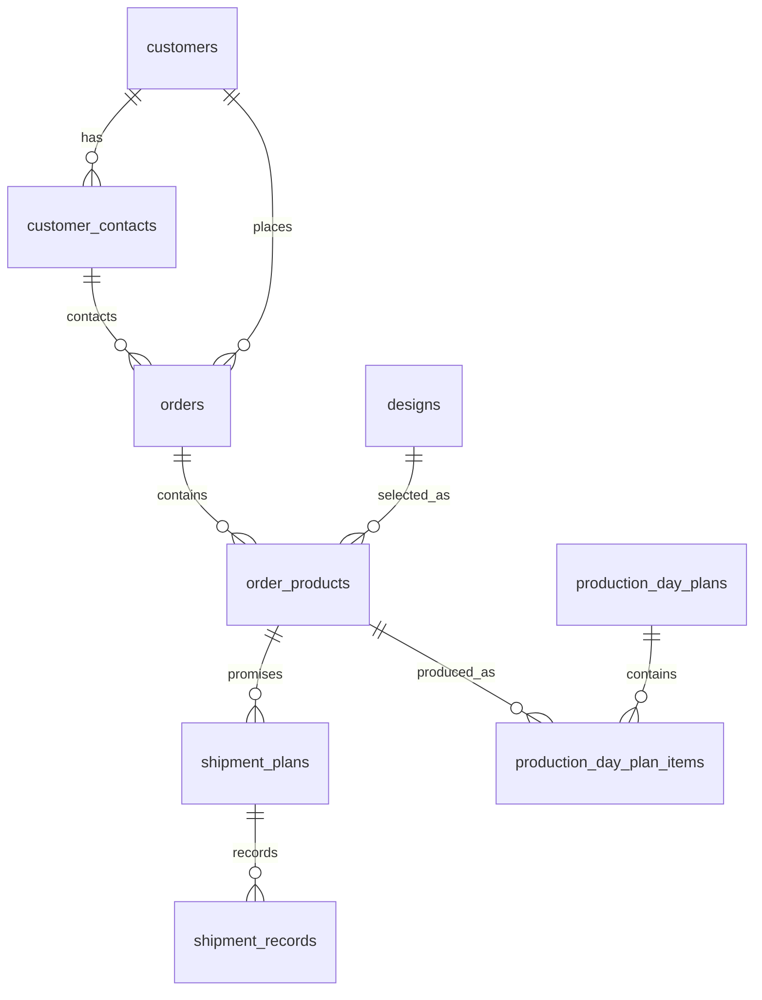

# 주문, 생산, 출하 데이터 구조

## 문서 목적

이 문서는 향후 데이터베이스를 처음부터 다시 설계할 때 기준으로 삼을 주문, 생산, 출하 데이터 구조를 정의한다.

사람과 AI Agent가 모두 참고할 수 있도록 도메인 의도, 객체 모델, 관계형 테이블 후보, 수량 계산 규칙, 제외해야 할 개념을 함께 기록한다.

## 상태

- 작성일: 2026-06-13
- 기준 방향: 제품 단위 생산 재고 모델
- 이 문서는 기존 `ProductionPlan -> ProductionDayPlan` 흐름을 대체하는 새 방향이다.
- 레거시 DB 스키마나 과거 테이블 구조는 이 문서의 판단 근거로 사용하지 않는다.
- 생산과 출하 데이터 구조를 설계할 때는 기존 `docs/order_data_model.md`보다 이 문서를 우선한다.

## 핵심 결정

생산은 특정 출하계획에 묶지 않는다.

주문 제품(`OrderProduct`) 단위로 생산하고, 완료된 생산량은 해당 주문 제품의 생산 완료 재고처럼 본다. 출하는 나중에 이 완료 생산량에서 차감한다.

따라서 다음 개념은 만들지 않는다.

- `ProductionPlan`
- 출하계획마다 자동 생성되는 빈 생산계획 draft
- `ProductionTimeAssignment`
- 생산 항목의 `shipmentPlanId`
- 수량이 비어 있는 생산계획 행

대신 `ProductionDayPlan`이 날짜와 부서의 생산계획 컨테이너가 되고, 그 안의 `plans[]` 항목이 실제 생산 작업 단위가 된다. 관계형 DB에서는 이 배열을 `production_day_plan_items` 테이블로 표현한다.

```text
Order
  -> OrderProduct
    -> ShipmentPlan[]
    -> ProductionDayPlanItem[]

ProductionDayPlan
  -> ProductionDayPlanItem[]

ShipmentPlan
  -> ShipmentRecord[]
```

## 설계 원칙

- `Order`는 고객 주문 헤더다.
- 하나의 `Order`는 하나 이상의 `OrderProduct`를 가진다.
- `OrderProduct`는 주문 안의 제품 라인이다. 수량, 제품 스냅샷, 생산 부서, 기본 생산속도의 기준 단위다.
- `ShipmentPlan`은 고객에게 약속한 출하 예정일과 수량이다.
- `ProductionDayPlan`은 특정 날짜와 부서의 생산 일정판이다.
- `ProductionDayPlanItem`은 특정 주문 제품을 특정 날짜에 얼마만큼 생산할지 나타내는 생산 작업 항목이다.
- 생산 항목은 `OrderProduct`만 참조하고 `ShipmentPlan`은 참조하지 않는다.
- 출하 실적은 `ShipmentRecord`에 기록하고, 해당 주문 제품의 완료 생산량에서 차감된 것으로 계산한다.
- 미계획 생산량은 저장하지 않고 계산한다.
- 한 주문 제품은 여러 날짜에 나누어 생산할 수 있다.
- 한 날짜 계획 안에도 같은 주문 제품이 여러 번 들어갈 수 있다.

## 객체 모델

```ts
type Order = {
  id: string;
  orderCode: string;

  customer: CustomerSnapshot;
  contact: ContactSnapshot;
  requestedDate: string;
  channel: string;

  products: OrderProduct[];

  status: "active" | "released" | "completed" | "cancelled";
};

type OrderProduct = {
  id: string;
  orderId: string;

  product: ProductSnapshot;
  quantity: number;

  shipmentPlans: ShipmentPlan[];
};

type ProductSnapshot = {
  designId: string;
  designNo: string;
  productName: string;
  specification: string;
  departmentCode: "R" | "S" | "P";
  defaultUnitsPerHour: number;
};

type ShipmentPlan = {
  id: string;
  orderId: string;
  orderProductId: string;

  plannedShipDate: string;
  quantity: number;
  status: "ready" | "partial" | "completed" | "stopped";

  shipmentRecords: ShipmentRecord[];
};

type ShipmentRecord = {
  id: string;
  shipmentPlanId: string;

  shippedDate: string;
  quantity: number;
};

type ProductionDayPlan = {
  id: string;
  productionDate: string;
  departmentCode: "R" | "S" | "P";
  workStartTime: string;

  plans: ProductionDayPlanItem[];
};

type ProductionDayPlanItem = {
  id: string;
  productionDayPlanId: string;
  orderProductId: string;

  quantity: number;
  completedQuantity: number;

  estimatedDurationMinutes: number;
  durationSource: "product_default" | "manual_override";

  workStatus: "planned" | "producing" | "completed" | "cancelled";

  sequence: number;
  startTime: string;
  endTime: string;
};
```

## 관계형 테이블 후보

### `customers`

고객 마스터다.

| 컬럼 | 타입 | 설명 |
| --- | --- | --- |
| `id` | `uuid` | PK |
| `name` | `text` | 고객명 |
| `ticker` | `text` | 주문번호 생성용 고객 코드 |
| `last_order_sequence` | `integer` | 고객별 누적 주문 순번 |
| `is_active` | `boolean` | 사용 여부 |
| `created_at` | `timestamptz` | 생성 시각 |
| `updated_at` | `timestamptz` | 수정 시각 |

주요 제약:

- `ticker`는 유일해야 한다.
- `ticker`는 대문자 영문 또는 숫자만 허용한다.

### `customer_contacts`

고객사 담당자 마스터다.

| 컬럼 | 타입 | 설명 |
| --- | --- | --- |
| `id` | `uuid` | PK |
| `customer_id` | `uuid` | FK to `customers.id` |
| `name` | `text` | 담당자명 |
| `phone` | `text` | 전화번호 |
| `email` | `text` | 이메일 |
| `is_active` | `boolean` | 사용 여부 |
| `created_at` | `timestamptz` | 생성 시각 |
| `updated_at` | `timestamptz` | 수정 시각 |

### `designs`

제품 또는 설계 마스터다.

| 컬럼 | 타입 | 설명 |
| --- | --- | --- |
| `id` | `uuid` | PK |
| `design_no` | `text` | 설계번호 |
| `product_name` | `text` | 제품명 |
| `specification` | `text` | 규격 |
| `department_code` | `department_code` | 생산 부서 |
| `default_units_per_hour` | `integer` | 기본 시간당 생산량 |
| `is_active` | `boolean` | 사용 여부 |
| `created_at` | `timestamptz` | 생성 시각 |
| `updated_at` | `timestamptz` | 수정 시각 |

주요 제약:

- `design_no`는 유일해야 한다.
- `default_units_per_hour > 0`

### `orders`

주문 헤더다. 제품, 수량, 출하계획, 생산계획은 직접 저장하지 않는다.

| 컬럼 | 타입 | 설명 |
| --- | --- | --- |
| `id` | `uuid` | PK |
| `order_code` | `text` | 사람이 보는 주문번호 |
| `customer_order_sequence` | `integer` | 고객별 누적 주문 순번 |
| `customer_id` | `uuid` | FK to `customers.id` |
| `contact_id` | `uuid` | FK to `customer_contacts.id` |
| `requested_date` | `date` | 고객 요청일 |
| `channel` | `text` | 주문 접수 채널 |
| `status` | `order_status` | 주문 상태 |
| `received_by` | `uuid` | 접수자 |
| `released_at` | `timestamptz` | 생산팀 전달 시각 |
| `released_by` | `uuid` | 생산팀 전달자 |
| `completed_at` | `timestamptz` | 완료 시각 |
| `completed_by` | `uuid` | 완료 처리자 |
| `cancelled_at` | `timestamptz` | 취소 시각 |
| `cancelled_by` | `uuid` | 취소 처리자 |
| `created_at` | `timestamptz` | 생성 시각 |
| `updated_at` | `timestamptz` | 수정 시각 |

주문번호 형식:

```text
O-{CUSTOMER_TICKER}-{YYMMDD}{CUSTOMER_ORDER_SEQUENCE}
```

예시:

```text
O-KE-26061300001
```

주요 제약:

- `order_code`는 유일해야 한다.
- 주문번호 생성은 고객 row 잠금, `last_order_sequence` 증가, 주문 생성이 한 트랜잭션에서 처리되어야 한다.
- 취소된 주문의 주문번호 순번은 재사용하지 않는다.

### `order_products`

주문 안의 제품 라인이다. 생산과 출하 수량 계산의 중심 테이블이다.

| 컬럼 | 타입 | 설명 |
| --- | --- | --- |
| `id` | `uuid` | PK |
| `order_id` | `uuid` | FK to `orders.id` |
| `design_id` | `uuid` | FK to `designs.id` |
| `quantity` | `integer` | 주문 제품 수량 |
| `design_no_snapshot` | `text` | 주문 시점 설계번호 |
| `product_name_snapshot` | `text` | 주문 시점 제품명 |
| `specification_snapshot` | `text` | 주문 시점 규격 |
| `department_code_snapshot` | `department_code` | 주문 시점 생산 부서 |
| `default_units_per_hour_snapshot` | `integer` | 주문 시점 기본 시간당 생산량 |
| `created_at` | `timestamptz` | 생성 시각 |
| `updated_at` | `timestamptz` | 수정 시각 |

주요 제약:

- `quantity > 0`
- `default_units_per_hour_snapshot > 0`
- 생산 부서와 생산속도는 주문 후 마스터가 바뀌어도 흔들리지 않도록 snapshot 값을 기준으로 사용한다.

### `shipment_plans`

고객에게 약속한 출하 예정일과 수량이다. 생산계획을 직접 참조하지 않는다.

| 컬럼 | 타입 | 설명 |
| --- | --- | --- |
| `id` | `uuid` | PK |
| `order_id` | `uuid` | FK to `orders.id` |
| `order_product_id` | `uuid` | FK to `order_products.id` |
| `planned_ship_date` | `date` | 출하 예정일 |
| `quantity` | `integer` | 출하 예정 수량 |
| `status` | `shipment_status` | 출하 상태 |
| `shipped_quantity` | `integer` | 누적 출하 수량 캐시 |
| `last_shipped_date` | `date` | 마지막 출하일 |
| `note` | `text` | 비고 |
| `created_at` | `timestamptz` | 생성 시각 |
| `updated_at` | `timestamptz` | 수정 시각 |

주요 제약:

- `quantity > 0`
- `shipped_quantity >= 0`
- `shipped_quantity <= quantity`
- 같은 `order_product_id`의 출하 예정 수량 합계는 `order_products.quantity`와 같아야 한다.
- `order_id`와 `order_product_id`는 같은 주문 계층에 속해야 한다.

상태 규칙:

```text
shipped_quantity = 0
  -> ready 또는 stopped

0 < shipped_quantity < quantity
  -> partial 또는 stopped

shipped_quantity = quantity
  -> completed
```

### `shipment_records`

실제 출하 이력이다. 출하는 특정 출하계획에 기록하지만, 생산 항목과는 연결하지 않는다.

| 컬럼 | 타입 | 설명 |
| --- | --- | --- |
| `id` | `uuid` | PK |
| `shipment_plan_id` | `uuid` | FK to `shipment_plans.id` |
| `shipped_date` | `date` | 실제 출하일 |
| `quantity` | `integer` | 실제 출하 수량 |
| `created_by` | `uuid` | 입력자 |
| `created_at` | `timestamptz` | 생성 시각 |

주요 제약:

- `quantity > 0`
- 같은 `shipment_plan_id`의 출하 이력 수량 합계는 `shipment_plans.quantity`를 초과할 수 없다.
- 같은 `order_product_id` 기준 전체 출하 수량은 완료 생산 수량을 초과할 수 없다.

출하 입력 후 같은 트랜잭션에서 다음 값을 갱신한다.

- `shipment_plans.shipped_quantity`
- `shipment_plans.status`
- `shipment_plans.last_shipped_date`

### `production_day_plans`

특정 날짜와 부서의 생산 일정판이다.

| 컬럼 | 타입 | 설명 |
| --- | --- | --- |
| `id` | `uuid` | PK |
| `production_date` | `date` | 생산일 |
| `department_code` | `department_code` | 생산 부서 |
| `work_start_time` | `time` | 작업 시작 시각 |
| `created_at` | `timestamptz` | 생성 시각 |
| `updated_at` | `timestamptz` | 수정 시각 |

주요 제약:

- `(production_date, department_code)`는 유일해야 한다.
- 기본 `work_start_time`은 `09:00`이다.

### `production_day_plan_items`

특정 날짜에 특정 주문 제품을 얼마만큼 생산할지 나타내는 생산 작업 항목이다.

이 테이블이 객체 모델의 `ProductionDayPlan.plans[]`에 해당한다.

| 컬럼 | 타입 | 설명 |
| --- | --- | --- |
| `id` | `uuid` | PK |
| `production_day_plan_id` | `uuid` | FK to `production_day_plans.id` |
| `order_product_id` | `uuid` | FK to `order_products.id` |
| `quantity` | `integer` | 계획 생산 수량 |
| `completed_quantity` | `integer` | 완료 생산 수량 |
| `estimated_duration_minutes` | `integer` | 예상 소요 시간 |
| `duration_source` | `production_duration_source` | 소요 시간 산정 방식 |
| `work_status` | `production_work_status` | 생산 작업 상태 |
| `sequence` | `integer` | 날짜 계획 안의 순서 |
| `start_time` | `time` | 시작 시각 |
| `end_time` | `time` | 종료 시각 |
| `note` | `text` | 비고 |
| `created_at` | `timestamptz` | 생성 시각 |
| `updated_at` | `timestamptz` | 수정 시각 |

주요 제약:

- `quantity > 0`
- `completed_quantity >= 0`
- `completed_quantity <= quantity`
- `estimated_duration_minutes > 0`
- `sequence > 0`
- `end_time > start_time`
- 같은 `production_day_plan_id` 안에서 `sequence`는 유일해야 한다.
- 생산 항목의 `order_product_id`가 가진 `department_code_snapshot`은 `production_day_plans.department_code`와 같아야 한다.
- 같은 `order_product_id`의 취소되지 않은 생산 항목 수량 합계는 `order_products.quantity`를 초과할 수 없다.

소요 시간 기본 계산:

```ts
estimatedDurationMinutes =
  Math.ceil((quantity / defaultUnitsPerHourSnapshot) * 60);
```

작업 상태 규칙:

```text
planned
  아직 생산 시작 전

producing
  생산 진행 중

completed
  completed_quantity = quantity

cancelled
  계획에서 제외된 항목
```

## Enum 후보

```sql
order_status:
  active
  released
  completed
  cancelled

department_code:
  R
  S
  P

shipment_status:
  ready
  partial
  completed
  stopped

production_duration_source:
  product_default
  manual_override

production_work_status:
  planned
  producing
  completed
  cancelled
```

## 핵심 수량 계산 규칙

### 주문 제품 수량

주문 제품은 출하계획 수량 합계와 같아야 한다.

```ts
sum(orderProduct.shipmentPlans.map((plan) => plan.quantity))
  === orderProduct.quantity;
```

### 생산 계획 수량

생산계획 수량은 `ProductionDayPlanItem` 기준으로 계산한다.

```ts
plannedProductionQuantity =
  sum(productionDayPlanItems
    .filter((item) => item.orderProductId === orderProduct.id)
    .filter((item) => item.workStatus !== "cancelled")
    .map((item) => item.quantity));
```

초기 모델에서는 계획 생산 수량 합계가 주문 제품 수량을 초과할 수 없다.

```ts
plannedProductionQuantity <= orderProduct.quantity;
```

미계획 생산 수량은 저장하지 않고 계산한다.

```ts
unplannedProductionQuantity =
  orderProduct.quantity - plannedProductionQuantity;
```

### 생산 완료 수량

```ts
completedProductionQuantity =
  sum(productionDayPlanItems
    .filter((item) => item.orderProductId === orderProduct.id)
    .filter((item) => item.workStatus !== "cancelled")
    .map((item) => item.completedQuantity));
```

주문 제품 기준 생산 완료까지 남은 수량:

```ts
remainingToCompleteProductionQuantity =
  orderProduct.quantity - completedProductionQuantity;
```

### 출하 수량

```ts
shippedQuantity =
  sum(shipmentRecords
    .filter((record) => record.shipmentPlan.orderProductId === orderProduct.id)
    .map((record) => record.quantity));
```

출하 가능 수량:

```ts
availableToShipQuantity =
  completedProductionQuantity - shippedQuantity;
```

출하 입력은 항상 다음 조건을 만족해야 한다.

```ts
shipmentRecord.quantity <= availableToShipQuantity
```

즉, 생산 완료되지 않은 수량은 출하할 수 없다.

## 주요 라이프사이클

### 주문 생성

1. 고객과 담당자를 선택한다.
2. 주문번호를 생성한다.
3. `orders`를 생성한다.
4. 하나 이상의 `order_products`를 생성한다.
5. 각 주문 제품 아래에 하나 이상의 `shipment_plans`를 생성한다.
6. 생산 관련 row는 생성하지 않는다.

주문 생성 시점에 빈 생산계획 draft를 만들지 않는다.

### 생산팀 전달

1. 주문 상태를 `released`로 바꾼다.
2. 생산 화면은 `released` 주문의 `order_products`를 조회한다.
3. 제품의 `department_code_snapshot`에 따라 생산 부서 화면에 노출한다.
4. 미계획 수량은 `orderProduct.quantity - plannedProductionQuantity`로 계산한다.

### 생산 일정 작성

1. 사용자가 생산일과 부서를 선택한다.
2. 해당 날짜와 부서의 `production_day_plans`를 생성하거나 조회한다.
3. 사용자가 주문 제품을 선택하고 생산 수량을 입력한다.
4. 시스템이 `estimated_duration_minutes`를 계산한다.
5. `production_day_plan_items`를 생성한다.
6. 같은 주문 제품의 계획 수량 합계가 주문 제품 수량을 넘지 않는지 검증한다.
7. 순서 변경 시 `sequence`, `start_time`, `end_time`을 갱신한다.

### 생산 진행 및 완료

1. 생산 시작 시 `work_status = producing`으로 변경한다.
2. 생산 실적 입력 시 `completed_quantity`를 갱신한다.
3. `completed_quantity = quantity`가 되면 `work_status = completed`로 변경할 수 있다.
4. 완료 생산량은 주문 제품 단위의 출하 가능 수량으로 누적된다.

### 출하

1. 사용자가 출하계획을 선택한다.
2. 시스템은 해당 출하계획의 `order_product_id`를 기준으로 `availableToShipQuantity`를 계산한다.
3. 입력한 출하 수량이 출하 가능 수량 이하인지 확인한다.
4. `shipment_records`를 생성한다.
5. `shipment_plans.shipped_quantity`, `status`, `last_shipped_date`를 갱신한다.

출하는 생산 항목을 직접 선택하지 않는다. 같은 주문 제품에서 완료된 생산량이 있으면 어느 생산일에 만들어진 물량인지는 따지지 않고 출하 가능 수량으로 본다.

## 생산 화면을 위한 조회 모델

### 생산일 기준 보기

기준 데이터:

- `production_day_plans`
- `production_day_plan_items`
- `order_products`
- `orders`
- `customers`

표시 단위:

- 날짜 + 부서의 생산 일정판
- 일정판 안의 생산 작업 항목

정렬:

- `sequence` 오름차순

시간 계산:

- 기본은 `work_start_time`부터 `sequence` 순서대로 연속 배치한다.
- 수동 조정이 필요하면 `start_time`, `end_time`을 직접 저장한다.

### 미계획 생산 대상

생산계획 draft row를 조회하지 않는다.

다음 조건으로 계산한다.

```ts
orderProduct.order.status === "released"
  && orderProduct.departmentCodeSnapshot === selectedDepartment
  && unplannedProductionQuantity > 0
```

미계획 카드의 수량은 `unplannedProductionQuantity`다.

### 출하 기준 보기

출하 기준 보기는 `shipment_plans`를 중심으로 표시한다.

단, 생산 커버리지는 출하계획별로 계산하지 않는다. 대신 같은 주문 제품의 생산/출하 요약을 함께 보여준다.

예시 표시값:

- 출하 예정 수량
- 해당 출하계획의 출하 완료 수량
- 주문 제품 전체 생산 완료 수량
- 주문 제품 전체 출하 가능 수량
- 주문 제품 전체 미완료 생산 수량

## 예시

주문 제품:

```text
OrderProduct A
- quantity: 300
- department: R
```

출하계획:

```text
ShipmentPlan 1: 2026-06-18 / 100개
ShipmentPlan 2: 2026-06-25 / 200개
```

생산일 계획:

```text
ProductionDayPlan: 2026-06-13 / R
  item 1: OrderProduct A / 150개 / 75분

ProductionDayPlan: 2026-06-14 / R
  item 1: OrderProduct A / 150개 / 75분
```

첫 번째 생산 항목이 완료되면:

```text
completedProductionQuantity = 150
shippedQuantity = 0
availableToShipQuantity = 150
```

6월 18일에 100개 출하하면:

```text
completedProductionQuantity = 150
shippedQuantity = 100
availableToShipQuantity = 50
```

두 번째 생산 항목이 완료되면:

```text
completedProductionQuantity = 300
shippedQuantity = 100
availableToShipQuantity = 200
```

## 관계 다이어그램



## AI Agent 구현 지침

- 새 DB를 설계할 때 `ProductionPlan`을 되살리지 않는다.
- 생산 항목은 `production_day_plan_items`로 만든다.
- `production_day_plan_items`에는 `shipment_plan_id`를 넣지 않는다.
- 생산계획 draft row를 만들지 않는다.
- 미계획 수량은 항상 계산한다.
- 출하 가능 수량은 주문 제품 단위의 완료 생산량에서 이미 출하된 수량을 뺀 값이다.
- 출하계획은 고객 약속 관리용이고, 생산계획의 부모가 아니다.
- 주문 제품의 제품명, 규격, 부서, 생산속도는 snapshot 컬럼을 기준으로 한다.
- 여러 row 합계가 필요한 제약은 단순 check constraint만으로 처리하지 말고 트랜잭션, 트리거, 서버 로직 중 하나로 강제한다.

## 추후 확장 후보

아래 항목은 초기 모델에는 넣지 않는다. 실제 필요가 생기면 별도 설계한다.

- 불량, 폐기, 재작업 수량
- 생산 실적 로그 테이블
- 생산 완료 재고의 lot 추적
- 특정 출하가 특정 생산 lot을 소비했다는 allocation 테이블
- 휴게시간, 점심시간, 교대조 규칙
- 설비 또는 작업자 배정
- 주문 제품 수량을 초과하는 예비 생산
