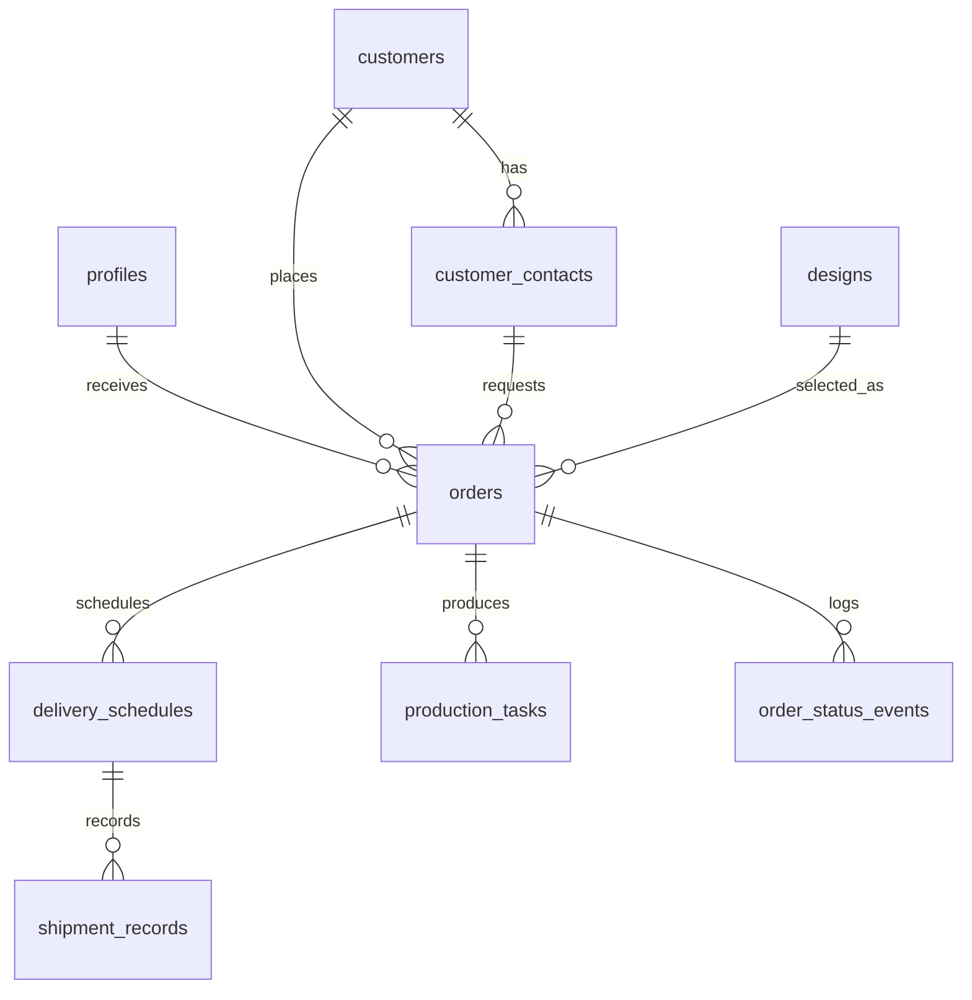

# DSS Database Schema Draft

**기준 문서**: `tech_spec.md`, `prd.md`, `information_architecture.md`, `feature_list.md`  
**데이터베이스**: Supabase PostgreSQL  
**목표**: POC 주문 관리 기능을 우선 구현하되, 생산/출하 확장을 막지 않는 최소 확장형 스키마

---

## 1. 설계 원칙

- 주문을 중심 객체로 둔다.
- 고객사와 담당자는 분리하되, 주문은 반드시 고객사 + 담당자 세트를 참조한다.
- 제품/설계 기준정보는 `designs`로 통합한다. 문서의 "제품 선택"과 "설계번호 조회"를 같은 기준정보로 처리한다.
- 주문 1건은 생산 품목 1개와 1:1로 매핑한다.
- 주문의 제품/설계와 발주 수량은 `orders`에 직접 둔다.
- 납기/출하예정일은 `delivery_schedules`에 둔다. 일반 출하는 1행, 분할 출하는 여러 행으로 표현한다.
- 생산 진행은 `orders`를 기준으로 확장한다.
- 출하 진행은 `delivery_schedules`를 기준으로 확장한다.
- `orders.status`는 제조 실행 상태가 아니라 주문 자체의 운영 상태만 표현한다.
- 생산 진행 상태는 `production_tasks.status`에서 관리한다.
- 출하 진행 상태는 `delivery_schedules.status`에서 관리한다.
- 주문 취소는 물리 삭제가 아니라 `orders.status = 'cancelled'`와 `cancelled_at` 기록으로 처리한다.
- 주문현황 UI는 `접수`, `생산`, `출하` 3개 탭만 노출한다. 취소/삭제된 라인아이템은 감사 추적용 데이터로 남기되 주문현황 탭에는 노출하지 않는다.
- `출하` 탭은 출하 완료만 의미하지 않는다. 생산은 완료됐지만 아직 출하가 완료되지 않은 품목이 존재하므로, 화면 용어는 `출하 완료`가 아니라 출하 업무 구간을 포괄하는 `출하`로 둔다.
- Supabase Auth 사용자를 직접 확장하지 않고, `profiles`에서 애플리케이션 사용자 정보를 관리한다.

---

## 2. Enum

### `app_role`

기술스택 정의서의 사용자 역할을 기준으로 한다.

| 값 | 의미 |
| --- | --- |
| `A` | Administrative (사무직) |
| `P` | Production (현장직, 팀장 포함) |
| `E` | Executive (임원) |

### `order_status`

주문 자체의 운영 상태만 표현한다. 생산 진행 상태나 출하 진행 상태를 포함하지 않는다.

| 값 | 화면 표시 | 설명 |
| --- | --- | --- |
| `active` | 접수/작업 가능 | 주문 접수 및 작업 가능 상태 |
| `released` | 생산 | 생산팀에 전달된 상태, Release to Production |
| `completed` | 출하 | POC 화면의 출하 탭 버킷. 최종 스키마에서는 생산 완료와 출하 진행 상태를 분리해 재정의해야 함 |
| `cancelled` | 취소 | 주문 취소 상태. 주문현황 UI 탭에는 노출하지 않음 |

### `delivery_type`

| 값 | 의미 |
| --- | --- |
| `single` | 일반 출하 |
| `split` | 분할 출하 |

### `department_code`

| 값 | 의미 |
| --- | --- |
| `R` | R 부서 |
| `S` | S 부서 |
| `P` | P 부서 |

### `production_status`

| 값 | 화면 표시 |
| --- | --- |
| `waiting` | 시작 대기 |
| `planning` | 계획중 |
| `producing` | 생산중 |
| `paused` | 일시중지 |
| `completed` | 생산완료 |

### `shipment_status`

| 값 | 화면 표시 |
| --- | --- |
| `ready` | 출하 준비 |
| `partial` | 일부 출하 |
| `completed` | 출하 완료 |
| `stopped` | 출하 중지 |

---

## 3. 테이블

### `profiles`

Supabase Auth 사용자와 DSS 사용자 역할을 연결한다.

| 컬럼 | 타입 | 제약 | 설명 |
| --- | --- | --- | --- |
| `id` | `uuid` | PK, FK `auth.users.id` | Supabase Auth 사용자 ID |
| `email` | `text` | not null, unique | 로그인 이메일 |
| `display_name` | `text` | not null | 화면 표시 이름 |
| `role` | `app_role` | not null | 사용자 역할 |
| `is_active` | `boolean` | not null default `true` | 사용 가능 여부 |
| `created_at` | `timestamptz` | not null default `now()` | 생성 시각 |
| `updated_at` | `timestamptz` | not null default `now()` | 수정 시각 |

---

### `customers`

고객사 기준정보다. POC에서는 기존 데이터 목록에서 선택만 한다.

| 컬럼 | 타입 | 제약 | 설명 |
| --- | --- | --- | --- |
| `id` | `uuid` | PK default `gen_random_uuid()` | 고객사 ID |
| `name` | `text` | not null | 고객사명 |
| `business_registration_no` | `text` | unique nullable | 사업자번호 |
| `identifier` | `text` | nullable | 기타 식별 정보 |
| `is_active` | `boolean` | not null default `true` | 사용 가능 여부 |
| `created_at` | `timestamptz` | not null default `now()` | 생성 시각 |
| `updated_at` | `timestamptz` | not null default `now()` | 수정 시각 |
| `deleted_at` | `timestamptz` | nullable | 기준정보 삭제 시각 |

---

### `customer_contacts`

고객사 담당자 기준정보다. 주문 입력 시 고객사 + 담당자 세트로 선택한다.

| 컬럼 | 타입 | 제약 | 설명 |
| --- | --- | --- | --- |
| `id` | `uuid` | PK default `gen_random_uuid()` | 담당자 ID |
| `customer_id` | `uuid` | FK `customers.id`, not null | 소속 고객사 |
| `name` | `text` | not null | 담당자명 |
| `phone` | `text` | nullable | 연락처 |
| `email` | `text` | nullable | 이메일 |
| `position` | `text` | nullable | 직책/직무 |
| `is_active` | `boolean` | not null default `true` | 사용 가능 여부 |
| `created_at` | `timestamptz` | not null default `now()` | 생성 시각 |
| `updated_at` | `timestamptz` | not null default `now()` | 수정 시각 |
| `deleted_at` | `timestamptz` | nullable | 기준정보 삭제 시각 |

권장 제약:

- `unique (customer_id, name, phone)` 또는 운영 데이터 품질에 맞춘 중복 방지 규칙

---

### `designs`

제품/설계 기준정보다. 문서의 "제품", "설계번호", "품명", "규격", "부서코드"를 담는다.

| 컬럼 | 타입 | 제약 | 설명 |
| --- | --- | --- | --- |
| `id` | `uuid` | PK default `gen_random_uuid()` | 설계 ID |
| `design_no` | `text` | not null, unique | 설계번호 |
| `product_name` | `text` | not null | 품명 |
| `specification` | `text` | not null | 규격 |
| `department_code` | `department_code` | not null | 부서코드 |
| `is_active` | `boolean` | not null default `true` | 사용 가능 여부 |
| `created_at` | `timestamptz` | not null default `now()` | 생성 시각 |
| `updated_at` | `timestamptz` | not null default `now()` | 수정 시각 |
| `deleted_at` | `timestamptz` | nullable | 기준정보 삭제 시각 |

메모:

- POC에서는 신규 제품/설계 등록을 구현하지 않지만, 샘플/기존 데이터를 적재해야 하므로 테이블은 필요하다.
- `designs`는 제품 기준정보 역할까지 겸한다. POC에서는 제품 선택과 설계번호 조회를 모두 이 테이블 기준으로 처리한다.

---

### `order_number_sequences`

주문번호 `YYMMDD-####` 생성을 위한 일자별 시퀀스 테이블이다.

| 컬럼 | 타입 | 제약 | 설명 |
| --- | --- | --- | --- |
| `sequence_date` | `date` | PK | 주문 생성일 |
| `last_sequence` | `integer` | not null default `0`, check `>= 0` | 해당 일자의 마지막 순번 |
| `updated_at` | `timestamptz` | not null default `now()` | 수정 시각 |

주문번호 생성 규칙:

- 날짜 기준은 주문 생성일이다.
- 같은 날짜 안에서 순번을 1씩 증가시킨다.
- 주문번호는 `YYMMDD-####` 형식이다.
- 취소된 주문번호는 재사용하지 않는다.
- `orders.order_no`에 unique constraint를 둔다.

---

### `orders`

주문 헤더다. 주문 상태 탭의 기준이 되는 핵심 테이블이다.

| 컬럼 | 타입 | 제약 | 설명 |
| --- | --- | --- | --- |
| `id` | `uuid` | PK default `gen_random_uuid()` | 주문 ID |
| `order_no` | `text` | not null, unique | 주문번호, 예: `260315-0001` |
| `status` | `order_status` | not null default `active` | 주문 운영 상태 |
| `requested_date` | `date` | not null | 주문 요청일 |
| `channel` | `text` | not null | 발주 채널. 프론트엔드 select box에서 정리된 값을 저장 |
| `customer_id` | `uuid` | FK `customers.id`, not null | 고객사 |
| `contact_id` | `uuid` | FK `customer_contacts.id`, not null | 담당자 |
| `design_id` | `uuid` | FK `designs.id`, not null | 제품/설계 |
| `quantity` | `integer` | not null, check `> 0` | 발주 수량 |
| `delivery_type` | `delivery_type` | not null | 일반/분할 출하 |
| `received_by` | `uuid` | FK `profiles.id`, not null | 주문 접수자 |
| `released_at` | `timestamptz` | nullable | 생산팀 전달 시각 |
| `released_by` | `uuid` | FK `profiles.id`, nullable | 생산팀 전달자 |
| `completed_at` | `timestamptz` | nullable | 주문 lifecycle 완료 시각 |
| `completed_by` | `uuid` | FK `profiles.id`, nullable | 주문 완료 처리자 |
| `created_at` | `timestamptz` | not null default `now()` | 생성 시각 |
| `updated_at` | `timestamptz` | not null default `now()` | 수정 시각 |
| `cancelled_at` | `timestamptz` | nullable | 취소 처리 시각 |
| `cancelled_by` | `uuid` | FK `profiles.id`, nullable | 취소 처리자 |

권장 제약:

- `status = 'released'`이면 `released_at`, `released_by`가 있어야 한다.
- `status = 'completed'`이면 `released_at`, `completed_at`, `completed_by`가 있어야 한다.
- `status = 'cancelled'`이면 `cancelled_at`, `cancelled_by`가 있어야 한다.
- `contact_id`가 `customer_id`에 속하는지는 트리거 또는 애플리케이션 검증으로 보장한다.

상태 책임 분리:

- `orders.status = 'released'`는 생산팀에 전달됐다는 운영 상태만 의미한다.
- 생산이 시작됐는지, 진행 중인지, 완료됐는지는 `production_tasks.status`로 판단한다.
- 출하 준비/일부 출하/출하 완료 여부는 `delivery_schedules.status`로 판단한다.
- UI의 `출하` 탭은 출하 완료만 의미하지 않는다. 생산 완료 후 아직 출하가 남아 있는 품목을 다룰 수 있어야 하므로, 최종 스키마에서는 `production_tasks.status = 'completed'`와 `delivery_schedules.status != 'completed'` 같은 조건을 조합해 출하 업무 대상을 도출하는 방향으로 재검토한다.
- `orders.status = 'completed'`는 주문의 전체 lifecycle이 종료됐다는 의미다.
- `orders.status = 'completed'`는 해당 주문의 모든 `delivery_schedules.status`가 `completed`일 때만 설정한다.

---

### `delivery_schedules`

납기 일정 / 출하 예정 계획과 해당 출하예정 건의 출하 진행 상태를 저장한다. 고객에게 언제, 얼마를 보내기로 했는지 약속된 계획이며, 일반 출하는 1행으로, 분할 출하는 여러 행으로 기록한다.

| 컬럼 | 타입 | 제약 | 설명 |
| --- | --- | --- | --- |
| `id` | `uuid` | PK default `gen_random_uuid()` | 출하예정 ID |
| `order_id` | `uuid` | FK `orders.id` on delete cascade, not null | 주문 |
| `scheduled_date` | `date` | not null | 출하예정일/납기일 |
| `quantity` | `integer` | not null, check `> 0` | 해당 예정일 수량 |
| `status` | `shipment_status` | not null default `ready` | 출하 상태 |
| `shipped_quantity` | `integer` | not null default `0`, check `>= 0` | 누적 출고 수량 |
| `last_shipped_date` | `date` | nullable | 마지막 출고일 |
| `note` | `text` | nullable | 비고 |
| `created_at` | `timestamptz` | not null default `now()` | 생성 시각 |
| `updated_at` | `timestamptz` | not null default `now()` | 수정 시각 |

권장 제약:

- 주문별 `delivery_schedules.quantity` 합계는 `orders.quantity`와 같아야 한다.
- 일반 출하(`orders.delivery_type = 'single'`)는 주문당 1행만 허용한다.
- 분할 출하(`orders.delivery_type = 'split'`)는 주문당 2행 이상을 권장한다.
- `shipped_quantity <= quantity`
- `shipped_quantity = 0`이면 상태는 `ready` 또는 `stopped`
- `0 < shipped_quantity < quantity`이면 상태는 `partial` 또는 `stopped`
- `shipped_quantity = quantity`이면 상태는 `completed`

합계 검증은 여러 행 합계가 필요하므로 check constraint보다 트리거 또는 Server Action 트랜잭션에서 처리한다.

---

### `production_tasks`

생산 실행 상태다. 주문이 생산팀에 release된 이후, 주문 단위의 실제 생산 작업을 관리한다.
하나의 주문은 여러 생산 작업으로 나뉠 수 있다. 예를 들어 주문 수량 1,000개를 300개, 300개, 400개로 세 번에 나누어 생산할 수 있다.

| 컬럼 | 타입 | 제약 | 설명 |
| --- | --- | --- | --- |
| `id` | `uuid` | PK default `gen_random_uuid()` | 생산 작업 ID |
| `order_id` | `uuid` | FK `orders.id` on delete cascade, not null | 주문 |
| `quantity` | `integer` | not null, check `> 0` | 해당 생산 작업 수량 |
| `status` | `production_status` | not null default `waiting` | 생산 진행 단계 |
| `assignee_name` | `text` | nullable | 담당자명 |
| `updated_by` | `uuid` | FK `profiles.id`, nullable | 마지막 변경자 |
| `created_at` | `timestamptz` | not null default `now()` | 생성 시각 |
| `updated_at` | `timestamptz` | not null default `now()` | 수정 시각 |
| `completed_at` | `timestamptz` | nullable | 생산완료 시각 |

생성 규칙:

- 주문이 생산팀에 전달되면 필요에 따라 하나 이상의 `production_tasks`를 생성한다.
- 생산 작업 수량 합계는 `orders.quantity`를 초과할 수 없다.
- 생산 작업을 사용하는 단계에서는 주문 완료 전까지 완료된 생산 작업 수량 합계가 `orders.quantity`와 정확히 같아야 한다.
- 초기 상태는 `waiting`이다.
- `production_tasks`는 `delivery_schedules`와 직접 연결하지 않는다. 생산 계획/실행 단위와 고객 납기/출하 예정 단위는 별도로 관리한다.

---

### `shipment_records`

실제 출하 이력을 저장한다. 부분 출하가 여러 번 발생할 수 있어, 각 출하 기록을 별도의 행으로 남긴다.

| 컬럼 | 타입 | 제약 | 설명 |
| --- | --- | --- | --- |
| `id` | `uuid` | PK default `gen_random_uuid()` | 출고 이력 ID |
| `delivery_schedule_id` | `uuid` | FK `delivery_schedules.id` on delete cascade, not null | 출하예정 |
| `shipped_date` | `date` | not null | 출고일 |
| `quantity` | `integer` | not null, check `> 0` | 실제 출고 수량 |
| `created_by` | `uuid` | FK `profiles.id`, not null | 입력자 |
| `created_at` | `timestamptz` | not null default `now()` | 생성 시각 |

입력 후 `delivery_schedules.shipped_quantity`, `delivery_schedules.status`, `delivery_schedules.last_shipped_date`를 갱신한다.

---

### `order_status_events`

주문 운영 상태 변경 이력이다. POC에서 필수는 아니지만 생산팀 전달/취소/완료 기록을 남기기 위해 권장한다.

| 컬럼 | 타입 | 제약 | 설명 |
| --- | --- | --- | --- |
| `id` | `uuid` | PK default `gen_random_uuid()` | 이벤트 ID |
| `order_id` | `uuid` | FK `orders.id` on delete cascade, not null | 주문 |
| `from_status` | `order_status` | nullable | 이전 상태 |
| `to_status` | `order_status` | not null | 변경 상태 |
| `changed_by` | `uuid` | FK `profiles.id`, nullable | 변경자 |
| `changed_at` | `timestamptz` | not null default `now()` | 변경 시각 |
| `note` | `text` | nullable | 비고 |

---

## 4. 주요 관계

---

## 5. POC 필수 테이블과 확장 테이블

### POC 필수

- `profiles`
- `customers`
- `customer_contacts`
- `designs`
- `order_number_sequences`
- `orders`
- `delivery_schedules`
- `order_status_events`

### POC에서 생성해도 되지만 화면은 나중에 붙일 테이블

- `production_tasks`
- `shipment_records`

메모:

- 현재 PRD 기준 POC는 생산/출하 전용 화면을 구현하지 않는다.
- POC 시점에는 `production_tasks`를 실제 생성하지 않고 `orders.status = 'released'`만 관리한다.
- `production_tasks`와 `shipment_records`는 후속 생산/출하 화면 확장을 위한 테이블이다.

---

## 6. 주요 트랜잭션

### 주문 생성

1. `order_number_sequences`에서 오늘 날짜의 다음 순번을 얻는다.
2. `orders`를 `status = 'active'`로 생성한다.
3. `delivery_schedules`를 1행 이상 생성한다.
4. 주문 수량과 납기 수량 합계가 같은지 검증한다.
5. `order_status_events`에 `to_status = 'active'` 이벤트를 기록한다.

### 주문 수정

1. `orders.status = 'active'`인 주문만 수정 가능하다.
2. `orders`, `delivery_schedules`를 하나의 트랜잭션에서 갱신한다.
3. 주문번호는 변경하지 않는다.
4. 주문 수량과 납기 수량 합계가 같은지 다시 검증한다.

### 생산팀 전달

1. `orders.status = 'active'`인 주문만 전달 가능하다.
2. `orders.status`를 `released`로 변경한다.
3. `released_at`, `released_by`를 기록한다.
4. `order_status_events`에 상태 변경 이벤트를 기록한다.

### 생산 작업 생성

1. `orders.status = 'released'`인 주문에 대해서만 생성 가능하다.
2. 생산 작업 수량 합계가 `orders.quantity`를 초과하지 않는지 확인한다.
3. `production_tasks`를 `waiting` 상태로 생성한다.
4. 생산 작업은 주문 기준으로 생성하며, `delivery_schedules`와 직접 연결하지 않는다.

### 주문 취소

1. `orders.status = 'active'`인 주문만 취소 가능하다.
2. `orders.status`를 `cancelled`로 변경한다.
3. `cancelled_at`, `cancelled_by`를 기록한다.
4. `order_status_events`에 상태 변경 이벤트를 기록한다.

### 주문 완료

1. 주문의 모든 `delivery_schedules.status`가 `completed`인지 확인한다.
2. 생산 작업을 사용하는 단계에서는 완료된 `production_tasks.quantity` 합계가 `orders.quantity`와 같은지 확인한다.
3. `orders.status`를 `completed`로 변경한다.
4. `completed_at`, `completed_by`를 기록한다.
5. `order_status_events`에 상태 변경 이벤트를 기록한다.

---

## 7. 권한/RLS 초안

역할은 `profiles.role`을 기준으로 한다.

| 테이블 | **A** | **P** | **E** |
| --- | --- | --- | --- |
| `orders` | 생성/수정/취소/전달/조회 | 조회 | 조회 |
| `delivery_schedules` | 주문 생성/수정 시 관리/조회 | 조회 | 조회 |
| `customers` | 조회 | 조회 | 조회 |
| `customer_contacts` | 조회 | 조회 | 조회 |
| `designs` | 조회 | 조회 | 조회 |
| `production_tasks` | 조회 | 생성/변경/조회 | 조회 |
| `shipment_records` | 조회 | 생성/조회 | 조회 |

메모:

- POC에서는 복잡한 접근 제어를 구현하지 않기로 했으므로, 초기에는 Server Actions에서 역할별 액션을 제한하고 RLS는 단순화할 수 있다.
- Supabase 클라이언트 직접 접근을 허용할 경우 RLS 정책을 반드시 켠다.
- POC에서는 고객/담당자/제품/설계 기준정보 삭제 기능을 제공하지 않는다. 다만 후속 기준정보 관리 화면 확장을 위해 `is_active`, `deleted_at` 기반 soft delete 구조는 유지한다.

---

## 8. 인덱스 초안

권장 인덱스:

- `orders (status, created_at desc)`
- `orders (order_no)`
- `orders (customer_id)`
- `orders (contact_id)`
- `orders (design_id)`
- `delivery_schedules (order_id)`
- `production_tasks (order_id)`
- `delivery_schedules (scheduled_date)`
- `delivery_schedules (status, updated_at desc)`
- `production_tasks (status, updated_at desc)`
- `shipment_records (delivery_schedule_id)`
- `customer_contacts (customer_id)`
- `designs (design_no)`

POC에서는 검색/정렬/페이지네이션 UI가 제외되어 있지만, 상태 탭 조회와 외래키 조인을 위해 기본 인덱스는 두는 것이 좋다.

---

## 9. 기존 스키마와의 충돌 검토

### `shipments` 제거와 `shipment_records` 연결

`delivery_schedules`와 `shipments`가 1:1로 같은 출하예정 건을 표현하고 있었기 때문에 `shipments`를 제거하고, 출하 상태 요약 컬럼을 `delivery_schedules`로 이동했다. 실제 출하 이력은 `shipment_records`가 `delivery_schedules`에 직접 연결한다.

| 기존 초안 | 충돌 내용 | 수정 방향 |
| --- | --- | --- |
| `shipments` 테이블 | `delivery_schedules`와 1:1로 분리되어 조인이 불필요하게 늘어남 | 제거 |
| `shipments.status` | 출하예정 건의 현재 출하 상태가 별도 테이블에 있음 | `delivery_schedules.status`로 이동 |
| `shipments.shipped_quantity` | 누적 출고 수량이 별도 테이블에 있음 | `delivery_schedules.shipped_quantity`로 이동 |
| `shipments.last_shipped_date` | 마지막 출고일이 별도 테이블에 있음 | `delivery_schedules.last_shipped_date`로 이동 |
| `shipment_entries` | 이름이 입력 항목 느낌에 가까움 | `shipment_records`로 변경 |
| `shipment_entries.shipment_id` | 제거된 `shipments`를 참조함 | `shipment_records.delivery_schedule_id`로 변경 |
| ERD의 `delivery_schedules -> shipments -> shipment_entries` 관계 | 출하 예정, 상태, 이력이 3단계로 분리됨 | `delivery_schedules -> shipment_records` 1:N 관계로 단순화 |

---

### `production_tasks`와 `delivery_schedules` 분리

생산 작업은 고객 납기/출하예정 단위가 아니라 주문 생산 실행 단위다. 주문 1건의 생산 수량이 여러 작업으로 나뉠 수 있으므로 `production_tasks`를 `delivery_schedules`가 아닌 `orders`에 연결하도록 수정했다.

| 기존 초안 | 충돌 내용 | 수정 방향 |
| --- | --- | --- |
| `production_tasks.delivery_schedule_id` | 생산 작업이 출하예정 건과 1:1로 고정되어, 1,000개 주문을 300/300/400으로 나누는 생산 실행을 표현하기 어려움 | 제거 |
| `production_tasks.delivery_schedule_id unique` | 출하예정 건당 생산 작업 1개만 허용함 | 제거 |
| `production_tasks.order_id` 없음 | 생산 작업이 어떤 주문의 생산 실행인지 직접 알기 어려움 | `order_id` 추가 |
| `production_tasks.quantity` 없음 | 생산 작업별 수량 분할을 표현할 수 없음 | `quantity` 추가 |
| ERD의 `delivery_schedules -> production_tasks` 관계 | 납기/출하 계획과 생산 실행 단위가 결합됨 | `orders -> production_tasks` 1:N 관계로 변경 |
| 생산팀 전달 시 `delivery_schedules`마다 작업 생성 | 생산 작업 생성 기준이 출하예정 일정에 묶임 | release 이후 필요에 따라 하나 이상의 생산 작업을 생성하는 방식으로 변경 |

---

### `orders`와 `order_items` 병합

주문 1건당 생산 품목이 1개로 고정되므로 별도의 `order_items` 테이블을 제거하고 `orders`에 `design_id`, `quantity`를 직접 배치했다.

| 기존 초안 | 충돌 내용 | 수정 방향 |
| --- | --- | --- |
| `order_items` 테이블 | 1:1 관계인데 별도 테이블을 두어 조인과 트랜잭션이 불필요하게 복잡함 | 제거 |
| `delivery_schedules.quantity` 합계 = `order_items.quantity` 합계 | `order_items` 제거 후 참조 대상이 사라짐 | `delivery_schedules.quantity` 합계 = `orders.quantity`로 변경 |
| ERD의 `orders -> order_items -> designs` 관계 | 실제 업무 규칙은 주문 1건 = 제품/설계 1개 | `orders.design_id -> designs.id`로 단순화 |
| POC 필수 테이블, 권한표, 인덱스, 트랜잭션의 `order_items` 참조 | 제거된 테이블 참조가 남으면 구현 기준과 불일치 | 모두 제거 또는 `orders` 기준으로 변경 |

---

### `orders.status` 책임 분리

`orders.status`를 주문 운영 상태로 제한하면서 기존 초안에서 다음 충돌을 수정했다.

| 기존 초안 | 충돌 내용 | 수정 방향 |
| --- | --- | --- |
| `received` | 접수 상태가 주문 운영 상태와 UI 탭 상태를 섞어 표현함 | `active`로 변경 |
| `in_production` | 주문 상태가 생산 진행 상태처럼 해석될 수 있음 | `released`로 변경하고, 실제 생산 진행은 `production_tasks.status`에서 관리 |
| `shipped` | 주문 상태가 출하 진행/완료 상태를 포함함 | `completed`로 변경하고, 실제 출하 상태는 `delivery_schedules.status`에서 관리 |
| `deleted` | 취소/삭제를 주문 운영 상태와 soft delete 용어로 혼용함 | `cancelled`로 변경 |
| `sent_to_production_at`, `sent_to_production_by` | 상태값 `released`와 용어가 맞지 않음 | `released_at`, `released_by`로 변경 |
| `deleted_at`, `deleted_by` | 새 상태값 `cancelled`와 용어가 맞지 않음 | `cancelled_at`, `cancelled_by`로 변경 |
| 주요 트랜잭션의 `received`, `in_production`, `deleted` 조건 | 새 enum과 불일치 | `active`, `released`, `cancelled`, `completed` 기준으로 변경 |
| 마지막 검토 질문의 `orders.status = 'in_production'` | 새 상태 모델과 불일치 | `orders.status = 'released'` 기준으로 변경 |

주문현황 UI 탭 정책:

- 주문현황 화면 탭은 `접수`, `생산`, `출하` 3개만 사용한다.
- 기존 `생산중` 라벨은 `생산`으로 줄인다. 생산 대기, 생산중, 생산완료 같은 상세 진행은 `production_tasks.status`에서 확장한다.
- 기존 `출하 완료` 라벨은 `출하`로 바꾼다. 생산은 완료됐지만 출하가 아직 완료되지 않은 품목이 존재하므로, 이 탭은 완료 상태가 아니라 출하 업무 구간을 나타내야 한다.
- 기존 `삭제됨` 탭은 제거한다. 취소/삭제된 라인아이템은 `orders.status = 'cancelled'`, `cancelled_at`, `cancelled_by`로 데이터에는 남기지만 주문현황 UI에는 노출하지 않는다.
- 현재 POC 목업에서는 DB의 `orders.status`가 `active`, `released`, `completed`, `cancelled`로 남아 있으므로 화면 버킷은 아래처럼 임시 해석한다.

| UI 라벨 | DB 기준 |
| --- | --- |
| 접수 | `orders.status = 'active'` |
| 생산 | `orders.status = 'released'` + 필요 시 `production_tasks.status` 조회 |
| 출하 | POC 목업에서는 `orders.status = 'completed'` 버킷을 사용하되, 최종 DB 재정의 시에는 생산 완료와 출하 진행을 조합해 산출 |

중요: 최종 스키마에서 `출하` 탭을 `orders.status = 'completed'`와 1:1로 고정하면 안 된다. `completed`는 주문 lifecycle 완료로 해석될 수 있지만, 사용자가 원하는 `출하` 탭은 생산 완료 이후 출하가 필요하거나 진행 중인 품목까지 포함해야 한다. 따라서 후속 스키마 재정의에서는 `production_tasks.status = 'completed'`와 `delivery_schedules.status in ('ready', 'partial', 'stopped')` 같은 출하 진행 조건을 별도로 모델링하거나 조회 뷰로 분리해야 한다.

---

## 10. 확정된 정책

1. `designs`는 제품 기준정보 역할까지 겸한다.
2. POC 시점에는 `production_tasks`를 실제 생성하지 않고 `orders.status = 'released'`만 관리한다.
3. POC에서는 고객/담당자/제품/설계 기준정보 삭제 기능을 제공하지 않는다. 단, 후속 확장을 위해 soft delete 구조는 유지한다.
4. 주문현황 UI는 `접수`, `생산`, `출하` 탭만 노출한다. `삭제됨` 탭은 제공하지 않는다.
5. UI의 `출하` 탭은 `출하 완료`가 아니다. 생산 완료 후 출하가 남아 있는 품목을 표현할 수 있도록 최종 스키마에서 생산 완료 상태와 출하 진행 상태를 분리한다.
6. 생산 작업 수량 합계는 항상 `orders.quantity`를 초과할 수 없다. 생산 작업을 사용하는 단계에서는 주문 완료 전까지 완료된 생산 작업 수량 합계가 `orders.quantity`와 정확히 같아야 한다.
