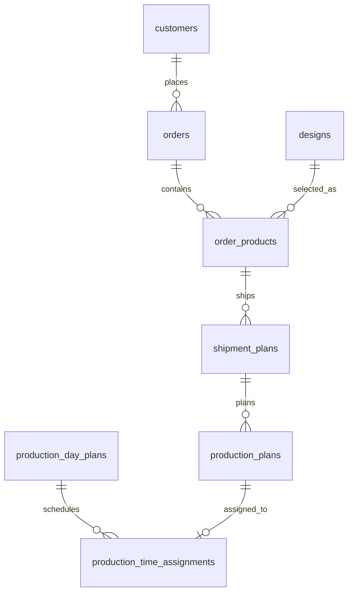

# Order Data Model

## Status

Drafted from the order, shipment, and production planning discussion on 2026-06-11.

This document defines the target data object and relational schema direction for orders that can contain multiple products. It supersedes the earlier single-product-per-order assumption in `docs/database_schema.md` for future schema work.

## Design Principles

- `Order` is the customer order header.
- One `Order` can contain multiple `OrderProduct` items.
- Quantity, shipment plans, and production plans belong to `OrderProduct`, not directly to `Order`.
- `ShipmentPlan` represents the customer-facing shipping promise for one ordered product.
- `ProductionPlan` represents a production-team planning item for one shipment plan.
- `ProductionPlan` is created as an empty draft when a `ShipmentPlan` is created.
- Production planning does not use a UX concept named "split". Multiple production plans can simply exist for the same shipment plan.
- `ProductionDayPlan` is the day + department container used by the production scheduling screen.
- Production time assignment starts at `09:00` by default and is scheduled continuously. Lunch breaks, rest breaks, and shift rules are out of the initial model.

## Object Model

```ts
type Order = {
  id: string;
  orderCode: string;

  customer: CustomerSnapshot;
  contact: ContactSnapshot;
  requestedDate: string;
  channel: string;

  products: OrderProduct[];

  status: "active" | "released" | "completed" | "cancelled";
};

type OrderProduct = {
  id: string;
  orderId: string;

  product: ProductSnapshot;
  quantity: number;

  shipmentPlans: ShipmentPlan[];
  productionPlans: ProductionPlan[];
};

type ShipmentPlan = {
  id: string;
  orderId: string;
  orderProductId: string;

  plannedShipDate: string;
  quantity: number;

  status: "ready" | "partial" | "completed" | "stopped";
};

type ProductionPlan = {
  id: string;
  orderId: string;
  orderProductId: string;
  shipmentPlanId: string;

  quantity: number | null;
  completedQuantity: number;

  estimatedDurationMinutes: number | null;
  durationSource: "product_default" | "manual_override" | null;

  workStatus: "unscheduled" | "scheduled" | "producing" | "completed";
};

type ProductSnapshot = {
  designId: string;
  designNo: string;
  productName: string;
  specification: string;
  departmentCode: "R" | "S" | "P";
  defaultUnitsPerHour: number;
};

type ProductionDayPlan = {
  id: string;
  productionDate: string;
  departmentCode: "R" | "S" | "P";
  workStartTime: string;
  assignments: ProductionTimeAssignment[];
};

type ProductionTimeAssignment = {
  id: string;
  productionDayPlanId: string;
  productionPlanId: string;
  sequence: number;
  startTime: string;
  endTime: string;
};
```

## Order Code

`orderCode` is the human-facing business code. `Order.id` remains the internal immutable UUID.

Format:

```text
O-{CUSTOMER_TICKER}-{YYMMDD}{CUSTOMER_ORDER_SEQUENCE}
```

Examples:

```text
O-KE-26061100001
O-JJ-26061100203
```

Parts:

| Part | Meaning |
| --- | --- |
| `O` | Order prefix |
| `KE`, `JJ` | Customer ticker |
| `260611` | Order creation or intake date in `YYMMDD` format |
| `00001`, `00203` | Five-digit cumulative order count for that customer |

Rules:

- `orderCode` must be unique.
- Customer ticker is required.
- Customer ticker should be uppercase letters or numbers.
- Customer order sequence is cumulative per customer, starts at `00001`, and is never reused.
- Cancelled orders do not release or reuse their sequence.

## Core Quantity Rules

For each `OrderProduct`:

```ts
sum(orderProduct.shipmentPlans.map((plan) => plan.quantity))
  === orderProduct.quantity;
```

For production plans:

```ts
sum(orderProduct.productionPlans.map((plan) => plan.quantity ?? 0))
  <= orderProduct.quantity;
```

The production-plan total does not need to match the shipment-plan total. This allows production teams to plan gradually.

For each `ShipmentPlan`, the UI should calculate production coverage:

```ts
type ShipmentProductionCoverage = {
  shipmentPlanId: string;
  shipmentQuantity: number;

  completedQuantity: number;
  inProgressRemainingQuantity: number;
  futurePlannedQuantity: number;
  unplannedQuantity: number;
};
```

Calculation:

```ts
completedQuantity =
  sum(completedQuantity of producing/completed production plans);

inProgressRemainingQuantity =
  sum(quantity - completedQuantity of producing production plans);

futurePlannedQuantity =
  sum(quantity of unscheduled/scheduled production plans);

unplannedQuantity =
  shipmentQuantity
  - completedQuantity
  - inProgressRemainingQuantity
  - futurePlannedQuantity;
```

## Production Plan Rules

- A `ProductionPlan` is generated automatically when a `ShipmentPlan` is created.
- The generated `ProductionPlan` starts empty:
  - `quantity = null`
  - `estimatedDurationMinutes = null`
  - `durationSource = null`
  - `completedQuantity = 0`
  - `workStatus = "unscheduled"`
- When `quantity` is null, `estimatedDurationMinutes` must also be null.
- When `quantity` is entered, `estimatedDurationMinutes` is calculated from the product default speed.
- Production teams can manually override `estimatedDurationMinutes`; this sets `durationSource = "manual_override"`.
- `completedQuantity` is stored directly on `ProductionPlan` in the initial model.
- Future production actual logs can later replace direct editing and make `completedQuantity` a derived or synchronized value.

Duration calculation:

```ts
estimatedDurationMinutes =
  Math.ceil((quantity / defaultUnitsPerHour) * 60);
```

Status rules:

```ts
quantity === null
  -> estimatedDurationMinutes === null

quantity !== null
  -> quantity > 0

completedQuantity >= 0
completedQuantity <= quantity

workStatus === "completed"
  -> completedQuantity === quantity

workStatus in ["producing", "completed"]
  -> quantity !== null
```

## Production Day Plan Rules

`ProductionDayPlan` is keyed by production date and department.

```text
productionDate + departmentCode
```

Rules:

- One department has one day plan per date.
- Default `workStartTime` is `09:00`.
- Assignments are ordered by `sequence`.
- If no manual time adjustment exists, assignments are scheduled continuously from `09:00`.
- A production plan can be assigned only to a day plan with the same department as the order product.

Example:

```text
ProductionDayPlan: 2026-06-12 / R

sequence 1: 09:00 - 10:30
sequence 2: 10:30 - 12:00
sequence 3: 12:00 - 14:00
```

## Proposed Relational Schema

### `customers`

Add a required customer ticker and sequence counter.

| Column | Type | Notes |
| --- | --- | --- |
| `id` | `uuid` | Primary key |
| `name` | `text` | Customer name |
| `ticker` | `text` | Required, unique business ticker such as `KE` or `JJ` |
| `last_order_sequence` | `integer` | Customer cumulative order count, default `0` |

### `designs`

Product/design reference data.

| Column | Type | Notes |
| --- | --- | --- |
| `id` | `uuid` | Primary key |
| `design_no` | `text` | Unique design number |
| `product_name` | `text` | Product name |
| `specification` | `text` | Product specification |
| `department_code` | `department_code` | Production department |
| `default_units_per_hour` | `integer` | Required production speed, `> 0` |

### `orders`

Order header. Does not store product, design, or total quantity directly.

| Column | Type | Notes |
| --- | --- | --- |
| `id` | `uuid` | Primary key |
| `order_code` | `text` | Unique, human-facing code such as `O-KE-26061100001` |
| `customer_order_sequence` | `integer` | Customer cumulative order sequence used in `order_code` |
| `customer_id` | `uuid` | FK to `customers.id` |
| `contact_id` | `uuid` | FK to `customer_contacts.id` |
| `requested_date` | `date` | Customer request date |
| `channel` | `text` | Order channel |
| `status` | `order_status` | Order lifecycle status |
| `received_by` | `uuid` | FK to `profiles.id` |
| `released_at` | `timestamptz` | Nullable |
| `released_by` | `uuid` | Nullable FK to `profiles.id` |
| `completed_at` | `timestamptz` | Nullable |
| `completed_by` | `uuid` | Nullable FK to `profiles.id` |
| `cancelled_at` | `timestamptz` | Nullable |
| `cancelled_by` | `uuid` | Nullable FK to `profiles.id` |
| `created_at` | `timestamptz` | Default `now()` |
| `updated_at` | `timestamptz` | Default `now()` |

Order-code generation must happen in one transaction:

1. Lock the target customer row.
2. Increment `customers.last_order_sequence`.
3. Store the new value in `orders.customer_order_sequence`.
4. Generate `orders.order_code`.

### `order_products`

One row per product in an order.

| Column | Type | Notes |
| --- | --- | --- |
| `id` | `uuid` | Primary key |
| `order_id` | `uuid` | FK to `orders.id`, cascade delete |
| `design_id` | `uuid` | FK to `designs.id` |
| `quantity` | `integer` | Required, `> 0` |
| `design_no_snapshot` | `text` | Design number at order time |
| `product_name_snapshot` | `text` | Product name at order time |
| `specification_snapshot` | `text` | Specification at order time |
| `department_code_snapshot` | `department_code` | Department at order time |
| `default_units_per_hour_snapshot` | `integer` | Production speed at order time |
| `created_at` | `timestamptz` | Default `now()` |
| `updated_at` | `timestamptz` | Default `now()` |

### `shipment_plans`

Customer-facing shipment plan for an order product.

| Column | Type | Notes |
| --- | --- | --- |
| `id` | `uuid` | Primary key |
| `order_id` | `uuid` | FK to `orders.id`, cascade delete |
| `order_product_id` | `uuid` | FK to `order_products.id`, cascade delete |
| `planned_ship_date` | `date` | Required |
| `quantity` | `integer` | Required, `> 0` |
| `status` | `shipment_status` | Default `ready` |
| `shipped_quantity` | `integer` | Default `0`, `>= 0` |
| `last_shipped_date` | `date` | Nullable |
| `note` | `text` | Nullable |
| `created_at` | `timestamptz` | Default `now()` |
| `updated_at` | `timestamptz` | Default `now()` |

Constraints:

- For each `order_product_id`, shipment-plan quantity total must equal `order_products.quantity`.
- `shipped_quantity <= quantity`.

### `production_plans`

Production-team planning item for a shipment plan.

| Column | Type | Notes |
| --- | --- | --- |
| `id` | `uuid` | Primary key |
| `order_id` | `uuid` | FK to `orders.id`, cascade delete |
| `order_product_id` | `uuid` | FK to `order_products.id`, cascade delete |
| `shipment_plan_id` | `uuid` | FK to `shipment_plans.id`, cascade delete |
| `quantity` | `integer` | Nullable, `> 0` when present |
| `completed_quantity` | `integer` | Required, default `0` |
| `estimated_duration_minutes` | `integer` | Nullable, `> 0` when present |
| `duration_source` | `production_duration_source` | Nullable |
| `work_status` | `production_work_status` | Default `unscheduled` |
| `created_at` | `timestamptz` | Default `now()` |
| `updated_at` | `timestamptz` | Default `now()` |

Constraints:

- `quantity is null` implies `estimated_duration_minutes is null`.
- `quantity is not null` implies `estimated_duration_minutes is not null`.
- `completed_quantity >= 0`.
- `completed_quantity <= quantity` when quantity is present.
- `work_status in ('producing', 'completed')` requires `quantity is not null`.
- `work_status = 'completed'` requires `completed_quantity = quantity`.
- For each `order_product_id`, sum of non-null production-plan quantity must be less than or equal to `order_products.quantity`.
- `order_id`, `order_product_id`, and `shipment_plan_id` must all belong to the same hierarchy.

### `production_day_plans`

Day + department schedule container.

| Column | Type | Notes |
| --- | --- | --- |
| `id` | `uuid` | Primary key |
| `production_date` | `date` | Required |
| `department_code` | `department_code` | Required |
| `work_start_time` | `time` | Default `09:00` |
| `created_at` | `timestamptz` | Default `now()` |
| `updated_at` | `timestamptz` | Default `now()` |

Constraints:

- Unique `(production_date, department_code)`.

### `production_time_assignments`

Assignment of a production plan to a day plan.

| Column | Type | Notes |
| --- | --- | --- |
| `id` | `uuid` | Primary key |
| `production_day_plan_id` | `uuid` | FK to `production_day_plans.id`, cascade delete |
| `production_plan_id` | `uuid` | FK to `production_plans.id`, cascade delete |
| `sequence` | `integer` | Required, `> 0` |
| `start_time` | `time` | Required |
| `end_time` | `time` | Required |
| `created_at` | `timestamptz` | Default `now()` |
| `updated_at` | `timestamptz` | Default `now()` |

Constraints:

- Unique `(production_day_plan_id, sequence)`.
- Unique `(production_plan_id)`, because one production plan can be on only one day plan at a time.
- `end_time > start_time`.
- Assigned production plan must belong to the same department as the day plan.

## Enum Additions

```sql
create type production_duration_source as enum (
  'product_default',
  'manual_override'
);

create type production_work_status as enum (
  'unscheduled',
  'scheduled',
  'producing',
  'completed'
);
```

Existing `shipment_status`, `department_code`, and `order_status` can be reused unless later workflow changes require renaming.

## Lifecycle

### Order Creation

1. Select customer and contact.
2. Generate `order_code` with the customer ticker and next customer cumulative sequence.
3. Create `orders`.
4. Create one or more `order_products`.
5. Create one or more `shipment_plans` under each order product.
6. For every shipment plan, create one empty `production_plans` draft.

### Production Planning

1. Production team reviews empty or partially filled production plans.
2. User enters quantity for a production plan.
3. System calculates `estimated_duration_minutes` from `default_units_per_hour_snapshot`.
4. User can manually override estimated duration.
5. User assigns the production plan to a date + department day plan.
6. The day plan schedules assignments from `09:00` by sequence.

### Production Progress

1. When production starts, set `work_status = 'producing'`.
2. User directly updates `completed_quantity` in the initial model.
3. When `completed_quantity = quantity`, the plan can become `completed`.
4. Later, production actual logs can replace direct quantity editing.

## Relationship Diagram


